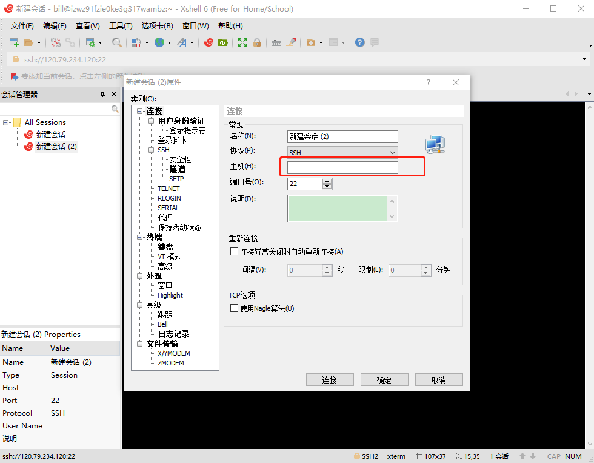

## 基于xshell的node发布流程
### 环境
* 服务器环境：centOS64位
* 本地环境：windows10 64位
* 连接工具：xshell6.0

### 1. 远程连接
* 打开xshell 新建会话 输入ip

* 输入root和用户密码
* 连接成功

### 2. 添加用户并授权
* 创建用户：useradd -d /home/bill -s /bin/bash -bill
* 设置密码：passwd miracle
* 为用户授权：visudo->输入字母i进入编辑->指定位置添加代码bill ALL=(ALL)ALL
->esc退出—>输入':wq'保存并退出

* 新建会话登录用户，验证是否成功

### 3. nodejs环境搭建
* 安装常用软件:sudo yum install vim openssl build-essential libssl-dev wget curl git
* nvm安装：wget -qO- https://raw.githubusercontent.com/creationix/nvm/v0.33.2/install.sh | bash
* 打开新窗口（注意要重启会话，不然报错）：nvm install v8.9.1->nvm use 8.9.1->
nvm alias default 8.9.1->npm install pm2
* 安装nvm(nvm时npm的版本管理工具)

### 4. nginx服务器代理
* 安装gcc：yum install gcc-c++
* 安装 pcre：yum install -y pcre pcre-devel
* 安装zlib：yum install -y zlib zlib -devel
* 下载niginx并安装：wget -c https://nginx.org/download/nginx-1.10.1.tar.gz
* 解压：tar -zxvf nginx-1.10.1.tar.gz
* 进入安装目录：cd nginx-1.10.1
* 选择默认配置：./configure
* 编译安装：make->make install
* 测试是否安装成功
* cd /usr/local/nginx/sbin/ -> ./nginx -t

### 5. 创建和部署hello world
* 返回根目录：cd~
* 创建目录：www，并在目录下创建hellos.js
~~~
const http = require('http')
http.createServer((req,res)=> {
res.writeHead(200,{'Content-Type':'text/plain'})
res.end('hello world')
}).listen(8000)

console.log('server')
~~~
* node hello.js
* 打开浏览器输入ip和端口号

### nginx常用命令
* ./nginx:启动
* ./nginx -s quit:退出
* ./nginx -s stop:强制退出
* ./nginx -s reload:重启

### 常见错误
* ~~~listen EADDRINUSE :::9999
   Error: listen EADDRINUSE :::9999
   ~~~
    端口占用：netstat -ntpl查看端口占用情况

    执行 kill -pid解除端口占用
* ~~~listen EADDRINUSE :::9999
     Error: listen EADDRINUSE :::9999
     ~~~
    无权限：改用sudo+命令，再输入密码
* [centos基本命令](https://www.cnblogs.com/webnote/p/5746648.html)

### 参考
1. https://www.linuxidc.com/Linux/2016-09/134907.htm
2. https://segmentfault.com/a/1190000010098126
2. https://blog.csdn.net/u014796999/article/details/60883129
3. https://www.cnblogs.com/webnote/p/5746648.html
4. https://blog.csdn.net/u012664191/article/details/70157788
